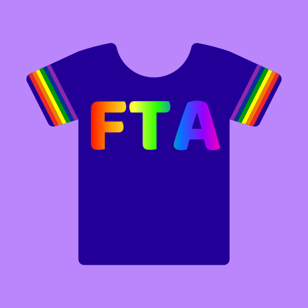

# FTA Buddy

<a href="https://ftabuddy.com/"><strong>Web App</strong></a>
 
<a href="https://github.com/Filip-Kin/fta-buddy/issues/new?assignees=&labels=bug&template=01_BUG_REPORT.md&title=bug%3A+">Report a Bug</a>
·
<a href="https://github.com/Filip-Kin/fta-buddy/issues/new?assignees=&labels=enhancement&template=02_FEATURE_REQUEST.md&title=feat%3A+">Request a Feature</a>

---

## About

This project was inspired by the [original FTA Buddy](https://github.com/kenschenke/FTA-Buddy-Android) app made by Ken Schenke.
It has since evolved to have a more mobile friendly field monitor, custom flashcards, more information in the reference page, and a notes section for communicating with other FTA(A)s and CSAs at events.
The field monitor uses a Chrome extension installed on a computer on the field network to scrape data. The extension sends the data to a locally run server that broadcasts it to the app through a websocket. It also sends that data to the cloud server, that way you can give volunteers a portable field monitor without having them on the field network. Plus, having fewer SignalR connections is always a good thing.
The cloud server also enables the notes functionality. The notes are also persistent between events, so if you have a team with a weird problem you can leave a note and the FTA at their next event can benefit!

## Getting Started

- Install the extension from the [Chrome webstore](https://chrome.google.com/webstore/detail/fta-buddy/kddnhihfpfnehnnhbkfajdldlgigohjc)
- Go to [ftabuddy.com](https://ftabuddy.com/) on a computer connected to the field network.
- Click Host *and optionally login first*.
- Enter the event code (e.g. 2024miket) and a passcode of your choosing, and click create event
- Visit [ftabuddy.com](https://ftabuddy.com/) on your phone, add/install the web app to your home screen for the best experience
- Login or create an account for yourself, then connect to the event with the same code and pin!

### Full Feature List
- Dark theme 
- Mobile optimized 
- Reduce signalR congestion 
- Access without being on field wifi
- Detailed status view with troubleshooting steps
- Vibration notifications when a robot drops during a match
- Tracking how long since the last status change happened 
- 👀 emoji helps identify robots that are taking longer than expected to connect 
- Flashcards to communicate through driver station glass
- Reference page with status light codes and other handy information 
- Dsplay signal strength information 
- Display last cycle time and timer for current cycle
- Audio notifications to quickly know which robot dropped and what disconnected 
- Cycle time tracking
- ***A way better*** event log viewer, give your CSAs access to the data that can help them help you help teams! 
- Synced team checklist to help track radio programming 
- Ticket and note system that's synchronized between events
- Current cycle will become more red as you approach 2x your average cycle time
- Last cycle time will be green if it's your best that event

**Coming soon:**
- Tracking connection time per team, and display 🕜 emoji when there's a team that takes 1 std deviation longer than the average team to connect 

## License

This project is licensed under the **MIT license**.

See [LICENSE](LICENSE) for more information.
